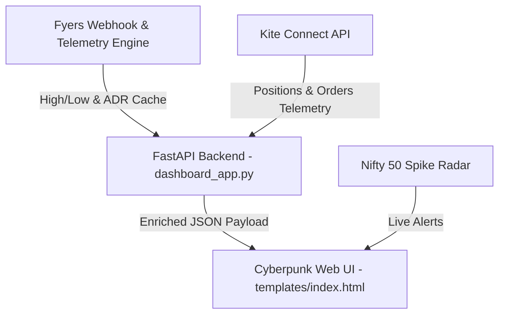

# Quant-Grade Session Context & Bootstrap Guide
**Date:** May 19, 2026  
**Session ID:** `06da8db1-f9c8-47e2-b3f1-41fe2c611fbc`  
**Purpose:** Bootstrap the next Gemini coding session with perfect state recall, zero token bloat, and absolute architectural clarity.

---

## 🎯 Current System Architecture Snapshot



### 1. Backend Engine (`dashboard_app.py` & `fyers_cache`)
* Runs a local Uvicorn FastAPI server on `127.0.0.1:8080`.
* Hosts a background telemetry cache (`fyers_cache`) that pools 5-minute indicators (EMA, VWAP, RSI, ADR) directly from Fyers API.
* Hosts lifecycle managers for starting/stopping the local engines and managing Kite Connect session state.

### 2. Kite Executions & Lifecycles
* Lives under `trade_setup/kite_execution_engine.py` with dynamic mode support (`Dry Run` vs `Live Execution`).
* Integrates a self-healing Kite Connect authorization manager which maintains state across page refreshes and handles automated logins.

---

## 🏆 Current Session Accomplishments (May 19, 2026)

### 🟢 1. Stateful File Pointers & Performance Optimization
* **Stateful File Pointers**: Implemented stateful read offsets (`self.file_pointers`) inside `KiteExecutionEngine` (`trade_setup/kite_execution_engine.py`) for CSV logs (`fyers.log`, `fyers_log_5m.csv`, `fyers_indicators_5m.csv`).
* **Incremental Memory Sync**: Added `sync_logs_to_memory()` to parse only newly written lines from files (seeking directly to the last processed byte offset) instead of reading full logs from disk, resolving CPU bottlenecks.
* **Memory Cap**: Added a circular memory boundary capped at `25000` rows per file to prevent RAM bloating over long runs.

### 🟢 2. Restart Protection & Broker Sync (Double-Buying Prevention)
* **Restart Broker State Sync**: Implemented `sync_broker_state()` inside the execution engine constructor to reconstruct memory during restarts:
  1. **Order Audit (Cooldown)**: Fetches today's orders. If a symbol has a status of `COMPLETE` or `REJECTED`, it's added to `self.completed_trades_today` to prevent the engine from executing a new trade on that stock today.
  2. **Position Audit (Active Management)**: Fetches live positions. If there is a non-zero MIS net position, the engine reconstructs the `active_trades` dictionary (`entry` price, `qty`, `direction`, and active `sl` / `sl_id` from pending trigger orders) and removes the symbol from `completed_trades_today` so the engine can manage stops/targets.
  This prevents duplicate buy/sell orders when restarting the execution engine.

### 🟢 3. Decoupled UI Polling & Resolved Kite Positions Duplicate Aggregation
* Resolved the Kite positions duplicate aggregation bug where certain symbols were counted multiple times.
* Decoupled UI polling callbacks to eliminate dashboard race conditions and prevent UI thread freezing.

### 🟢 4. Server-Side Positions Telemetry Enrichment & Real-Time ADR Progress Bars
* Modified `/api/kite/positions` in `dashboard_app.py` to fetch `today_high`, `today_low`, and `adr_abs` from the Fyers cache.
* Calculates the exact mathematical range exhaustion: `adr_exhaustion_pct = (today_range / adr_abs_val) * 100.0`.
* Built dynamic visual markers at **70% ADR** (Trailing Stop Trigger) and **75% ADR** (Scale-Out Profit Target Zone) in `templates/index.html`.
* Programmed the **Explosive Gold Pulse Alert**: When a stock hits or penetrates the $\ge 75\%$ ADR zone, a custom keyframe animation is triggered via CSS (`style.css`), pulsing the progress bar in glowing amber gold to prompt immediate profit booking.

### 🟢 5. Decoupled Dual Watchlists (Buy & Sell Columns)
* decapped `watchlist.json` into separated lists:
  ```json
  {"buy": ["NSE:APOLLO-EQ", ...], "sell": ["NSE:HINDCOPPER-EQ", ...]}
  ```
* Refactored `/api/add_symbol` and `/clear_watchlist` endpoints in `dashboard_app.py` to support `direction` query parameter (`buy` or `sell`).
* Split the Search Results dropdown action buttons into dedicated **`+ BUY`** and **`+ SELL`** selection triggers.
* Split the dashboard watchlist cards layout into two visual panels (Green for **BUY WATCHLIST**, Red for **SELL WATCHLIST**) with standalone clear buttons.

### 🟢 6. Upgraded Stock Search & Autocomplete UX
* **Input Trigger**: Upgraded from `keyup` to `oninput` inside `#stock-search` input to support mouse paste, screen keyboards, and instant typing responses.
* **Auto-Close & Re-Focus**:
  - Clicking outside the search card container closes the results list.
  - Refocusing the search input box immediately re-triggers and displays matching results if query length is $\ge 2$ characters.
* **JS Error Protection**: Wrapped the fetch operations in `searchStocks(q)` inside robust `.catch()` blocks, logging network/API errors cleanly to the browser console and rendering a warning indicator inside the search container without throwing uncaught promise rejections.

### 🟢 7. Watchlist Layout Realignment
* Moved the `Active Watchlists` card element outside of the `.side-col` sidebar container and placed it directly inside the main `.grid` container in `templates/index.html`.
* This layout correction allows the watchlists container to span the full grid width (`grid-column: span 2;`) dynamically, formatting the BUY and SELL columns side-by-side in a spacious layout at the bottom.

---

## 🔮 Active Telemetry & Auth Status
* **Fyers API Auth:** `TOKEN ACTIVE` (Good for today).
* **Kite Connect Auth:** `KITE CONNECT ACTIVE` (Fully authenticated, fetching positions, orders, margins, and buying power).
* **Dashboard URL:** [http://127.0.0.1:8080](http://127.0.0.1:8080)

---

## 🚀 Bootstrap Instructions for the Next Session

When the next AI session boots up, the model must:
1. **Acknowledge current auth status**: Both Fyers and Kite connections are live and synchronized.
2. **Re-evaluate task state**:
   - The dual watchlists are functional and verified.
   - The autocomplete search dropdown is verified, with active focus, blur/click-outside, and network catch hooks.
   - The watchlists have been correctly positioned outside of the sidebar.
   - The file pointers and restart protection (broker sync) logic inside `kite_execution_engine.py` are operational.
3. **Execution Objectives for the Next Session**:
   - Implement dynamic realized/unrealized R:R badges for active positions.
   - Build OCO Order Book Synchronizer (Ghost Bracket Orders) to mitigate duplicate exposure risk on system restart or scale-out execution.
   - Maintain strict capital preservation protocols.
