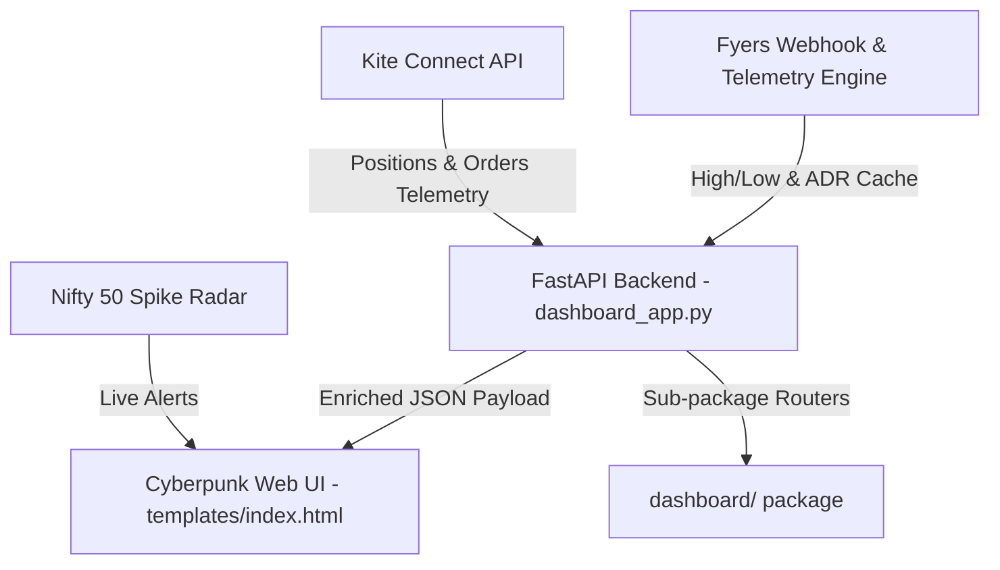

# Quant-Grade Session Context & Bootstrap Guide
**Date:** May 20, 2026  
**Purpose:** Bootstrap the next Gemini coding session with perfect state recall, zero token bloat, and absolute architectural clarity.

---

## 📌 Previous Session Recap (May 19, 2026)

- **Stateful File Pointers**: Incremental seeking (`sync_logs_to_memory`) of CSV files with a `25,000` row memory limit to prevent CPU/RAM bloat.
- **Broker State Sync (Double-Buy Protection)**: Execution engine constructor automatically audits today's orders/positions on restart, restoring stops/targets and cooldown states.
- **ADR Exhaustion Telemetry**: Live range exhaustion `(today_range / adr_abs_val) * 100.0` with trailing triggers at `70%` and scale-out triggers at `75%` (Gold CSS pulsing bar).
- **Dual Watchlists & Stock Search**: Splitted Green/Red watchlists and search autocomplete with robust refocus and error catches.

---

## 🎯 Current System Architecture Snapshot



### 1. Modularized Execution Engine (`trade_setup/` package)
- `kite_execution_engine.py` acts as a lightweight entry point class.
- Core business logic is split into `trade_setup/engine/`:
  - `telemetry.py` (stateful file log reading offsets)
  - `costs.py` (slippages and transaction charges calculations)
  - `journal.py` (trade journaling to markdown ledger)
  - `rules.py` (trading boundaries and rules enforcement)
  - `risk.py` (drawdown limit checks and absolute risk boundaries)
  - `orders.py` (placing stoploss triggers, exit triggers, and limit orders)
  - `auditor.py` (startup sync state and restart double-buy prevention)

### 2. Modularized Dashboard Server (`dashboard/` package)
- `dashboard_app.py` is reduced to an orchestrator entry point that loads background tasks, mounts static directories, and registers FastAPI sub-routers.
- Business routes and global state handlers are split into `dashboard/`:
  - `cache.py` (Fyers indicators cache, background loops, and radar alerts store)
  - `utils.py` (watchlist loaders, responses, trend signaling, and indicator HTML styling helpers)
  - `routes_web.py` (Jinja2 frontend server and callback OAuth flows)
  - `routes_system.py` (logger controls, radar controls, browser launching, and tab syncing)
  - `routes_api.py` (stock search queries, watchlist additions, logs, and live table rows generation)
  - `routes_kite.py` (Kite positions, orders, panic triggers, scale-outs, and stop loss trailing)
  - `routes_radar.py` (spike alert hooks and CDP tab navigation controllers)

---

## 🏆 Current Session Accomplishments (May 20, 2026)

### 🟢 1. Modularized Kite Intraday Execution Engine
- Extracted and modularized the 1000+ line execution engine monolithic file into clean, standalone Python components inside `trade_setup/engine/`.
- Guaranteed 100% logic parity and clean imports across all extracted files.

### 🟢 2. Restructured Repository Assets & Cleaned Directory Tree
- Extracted all non-code files from the `trade_setup/` folder to clean up the workspace structure:
  - Moved strategy configuration parameters to `notes_and_plans/`.
  - Moved stock selection text lists to `data/selected_stocks/`.
  - Redirected the engine ledger file output location to the project-root markdown ledger `trade_journal.md`.

### 🟢 3. Configured Capital & Credentials Git Protection
- Redefined `.gitignore` rules to shield account balances, taken trades, logs, credentials, and API access keys from public commits, while keeping all new execution engine and dashboard package code files fully versioned.

### 🟢 4. Modularized FastAPI Monolithic Server
- Refactored `dashboard_app.py` from 1,279 lines to less than 40 lines of pure initialization code.
- Created `dashboard/` sub-package utilizing FastAPI's standard `APIRouter` design.
- Re-routed Fyers indicators caching, Web templates, controls, search APIs, Kite positions enrichment, and Nifty 50 Spike Radar into modular components with zero regression.

### 🟢 5. Validated Imports & Compilation Parity
- Verified successful syntax compilation for all modules using the virtual environment interpreter:
  ```bash
  ./venv/bin/python3 -m py_compile dashboard_app.py dashboard/*.py
  ```
- Verified programmatic import of the FastAPI `app` instance with zero circular dependency or module import errors:
  ```bash
  ./venv/bin/python3 -c "from dashboard_app import app"
  ```

### 🟢 6. Committed and Synced Changes
- Tracked all new changes, staged files, committed with clean descriptions, and pushed to the remote branch `origin/feat/engine-modularization`.

---

## 🚀 Bootstrap Instructions for the Next Session

When the next AI session boots up, the model must:
1. **Acknowledge current auth status**: Both Fyers and Kite connections are live and synchronized.
2. **Re-evaluate task state**:
   - The modular sub-package architecture is operational and compile-verified.
   - The directory tree is clean with sensitive assets git-ignored.
3. **Next Execution Objectives**:
   - Implement dynamic realized/unrealized R:R badges for active positions.
   - Build OCO Order Book Synchronizer (Ghost Bracket Orders) to mitigate duplicate exposure risk on system restart or scale-out execution.
   - Maintain strict capital preservation protocols.
